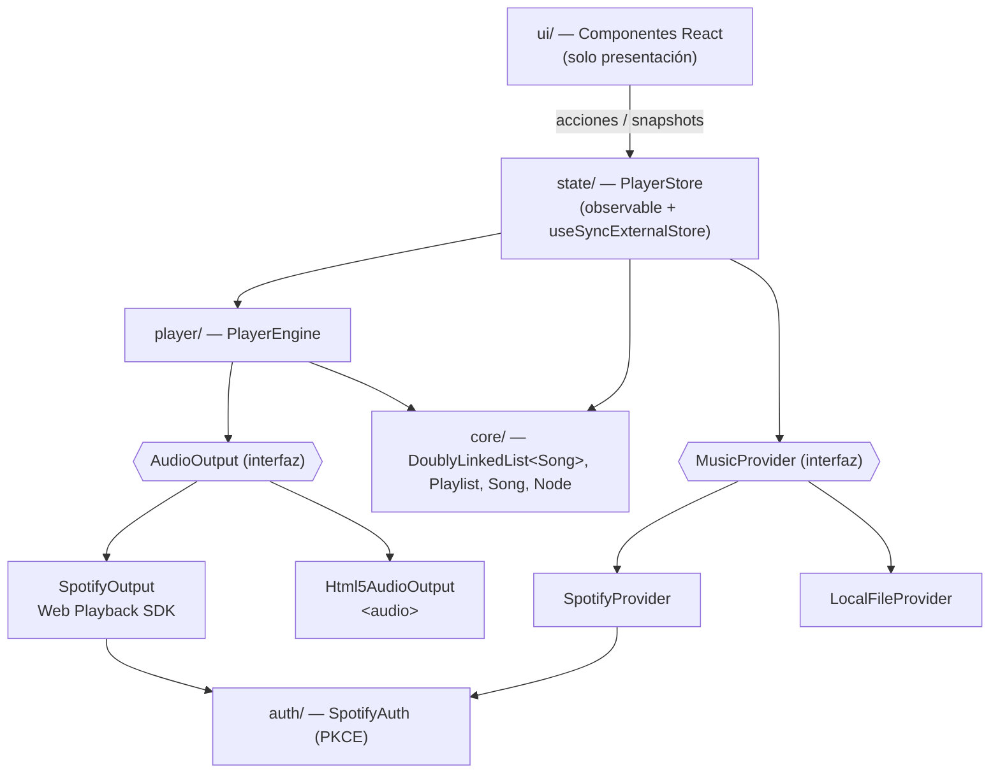
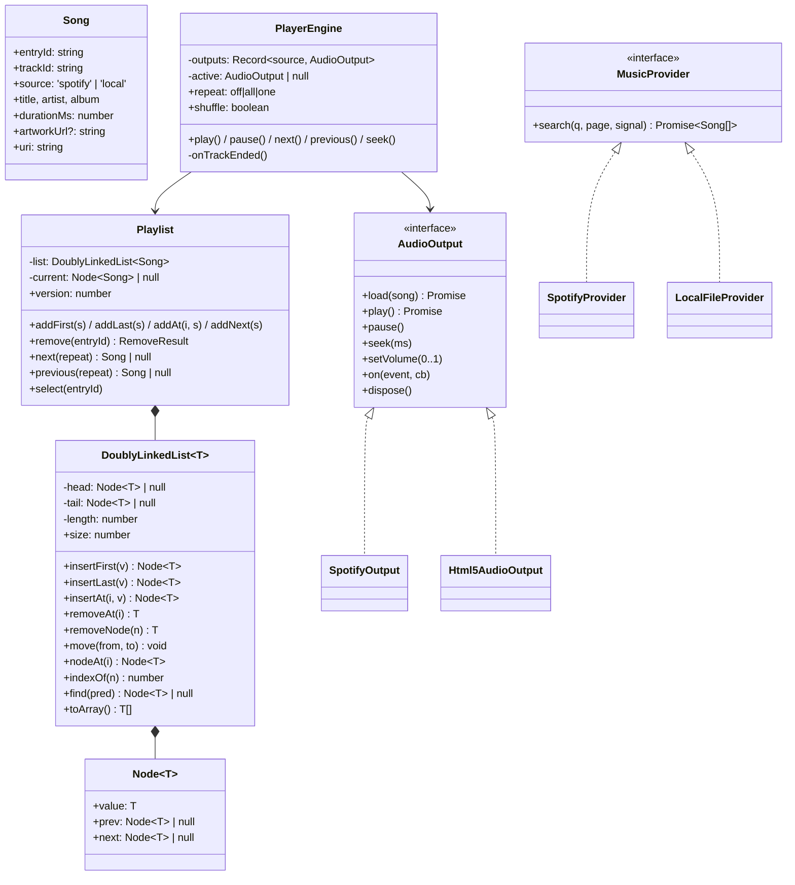
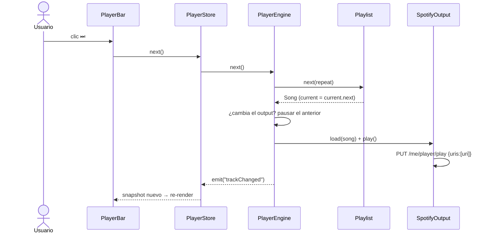
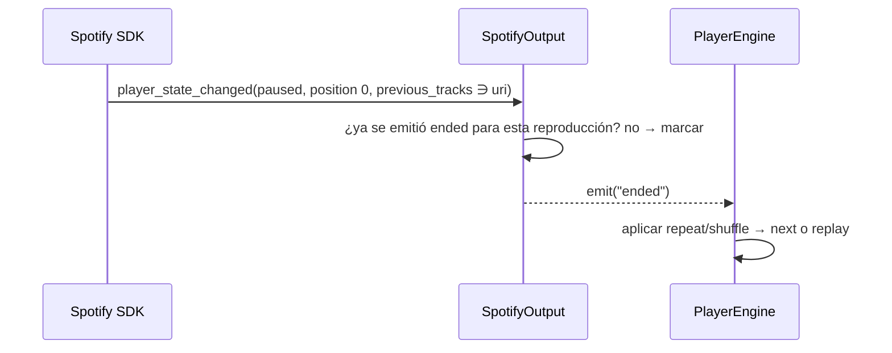

# Arquitectura

## Capas



**Regla:** las flechas solo apuntan hacia abajo. `core/` no importa nada.

## Clases principales



## Secuencia: el usuario pulsa "Siguiente"



## Secuencia: termina una canción de Spotify



## Estado expuesto a React (snapshot inmutable)

```ts
interface PlayerSnapshot {
  songs: readonly Song[];          // toArray() memoizado por playlist.version
  currentEntryId: string | null;
  status: 'idle' | 'loading' | 'playing' | 'paused' | 'error';
  positionMs: number;              // solo lo consume <ProgressBar/>
  durationMs: number;
  volume: number; muted: boolean;
  repeat: 'off' | 'all' | 'one'; shuffle: boolean;
  spotify: 'disconnected' | 'connecting' | 'ready' | 'no-premium' | 'unsupported' | 'error';
  error: string | null;
}
```
- `getSnapshot()` debe devolver **la misma referencia** si nada cambió, porque si no `useSyncExternalStore` entra en un bucle.
- El progreso tiene una suscripción aparte (`subscribeProgress`), para no re-renderizar toda la lista cuatro veces por segundo.
