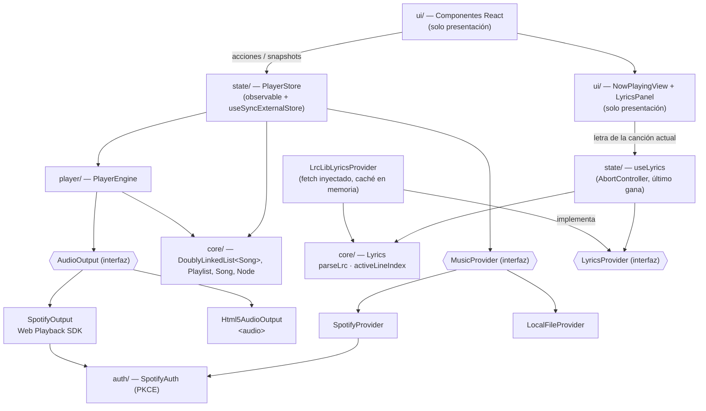
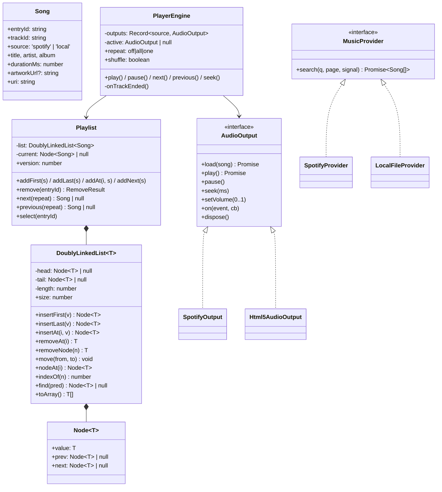
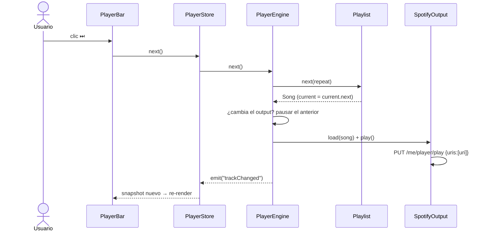
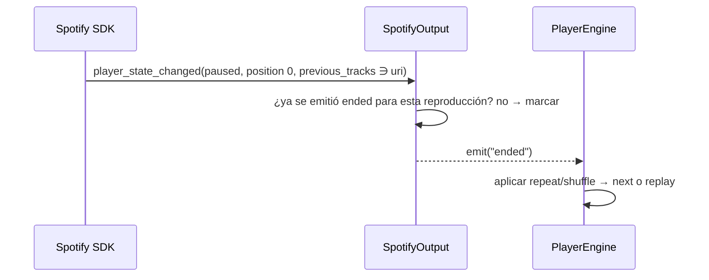
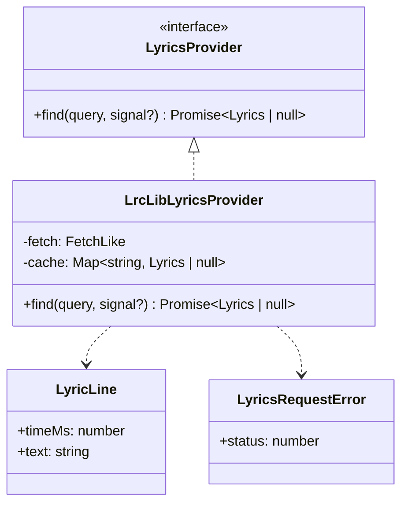

# Arquitectura

## Capas



**Regla:** las flechas solo apuntan hacia abajo. `core/` no importa nada.

## Clases principales



## Secuencia: el usuario pulsa "Siguiente"



## Secuencia: termina una canción de Spotify



## Favoritos

- **Fuente de verdad única**: Favoritos es una `Playlist` más dentro de la `DoublyLinkedList<Playlist>` de `PlaylistLibrary`, con `kind: 'favorites'`. Una canción es favorita **si y solo si** alguna entrada de esa playlist tiene su `trackId`; no hay un conjunto paralelo que se pueda desincronizar.
- `PlaylistLibrary.like(track, name)` crea Favoritos con el primer corazón (insertada al inicio de la lista de playlists) y agrega la canción al final; `unlike(trackId)` quita todas sus entradas. Favoritos no se puede renombrar ni eliminar, y solo puede haber una.
- `PlayerStore.toggleFavorite(track)` / `toggleFavoriteEntry(entryId)` nunca cambian la playlist activa ni cortan la reproducción; si Favoritos es la activa, avisan al `PlayerEngine` como cualquier otra mutación. El snapshot expone `favoriteTrackIds` (misma referencia mientras no cambie) y `PlaylistSummary.kind`.
- Persistencia: cada playlist guarda su `kind`; los datos anteriores, sin `kind`, se leen como playlists normales.
- UI: `FavoriteButton` (barra, Reproduciendo ahora, filas) y los menús; la etiqueta dice lo que hará el botón ("Agregar … a Favoritos" / "Quitar … de Favoritos") y el estado cambia también la forma (corazón relleno).

## Letras (LRCLIB)

Spotify Web API no tiene un endpoint público de letras, así que las letras vienen de [LRCLIB](https://lrclib.net), que es gratuito, no pide API key y responde con `Access-Control-Allow-Origin: *`. Las piezas se reparten así:

- **`core/Lyrics.ts`** (dominio puro, sin fetch ni React): `parseLrc(lrc)` convierte el texto LRC en `LyricLine[]`, y `activeLineIndex(lines, positionMs)` busca la línea activa con búsqueda binaria.
- **`providers/LyricsProvider.ts`**: la interfaz `LyricsProvider` (Strategy), con `find(query, signal?)`, que resuelve `null` cuando no hay letra, y el error `LyricsRequestError` (con `status`) para los fallos.
- **`providers/LrcLibLyricsProvider.ts`**: implementa la interfaz. Recibe `fetch` por constructor, tiene caché en memoria y valida la respuesta de LRCLIB antes de usarla.
- **`state/useLyrics.ts`**: el hook que pide la letra de la canción actual. Cancela la petición anterior con `AbortController`, así que solo gana la última canción.
- **`ui/` (`NowPlayingView`, `LyricsPanel`)**: solo pinta los estados y llama a `onSeek`. No conoce LRCLIB.

```ts
// core/Lyrics.ts
interface LyricLine { readonly timeMs: number; readonly text: string }
type Lyrics =
  | { kind: 'synced'; lines: readonly LyricLine[] }
  | { kind: 'plain'; lines: readonly string[] }
  | { kind: 'instrumental' };
```



## Secuencia: cambia la canción actual (letra)

```mermaid
sequenceDiagram
  participant S as PlayerStore
  participant H as useLyrics
  participant P as LrcLibLyricsProvider
  participant L as LRCLIB
  participant V as NowPlayingView
  S-->>H: la canción actual cambió
  H->>H: abort() de la petición anterior
  alt no hay canción
    H-->>V: idle
  else caché con la misma clave
    P-->>H: Lyrics (sin red)
  else
    H->>P: find(query, signal)
    P->>L: GET /api/get (título, artista, álbum, duración)
    alt 404
      P->>L: GET /api/search (título, artista)
      P->>P: elegir la duración más cercana (<= 3 s)
    end
    L-->>P: JSON (syncedLyrics, plainLyrics o instrumental)
    P->>P: parseLrc sobre syncedLyrics
    P-->>H: Lyrics o null
  end
  H-->>V: LyricsStatus (loading, ready, empty o error)
  V->>V: subscribeProgress, activeLineIndex(lines, positionMs)
  V-->>V: solo cambia el atributo aria-current de la línea activa
```



Reglas de esta secuencia:
- Un `AbortError` **no** es un error para la UI. El hook lo ignora y tampoco se guarda en caché.
- Se guardan en caché los resultados `synced`, `plain`, `instrumental` y `null` (no encontrado), con clave normalizada (título, artista y duración redondeada). Los errores de red o de HTTP **no** se guardan.
- `activeLineIndex` se calcula en cada tick del progreso, con la misma suscripción `subscribeProgress` que la barra. La lista de la letra no se vuelve a renderizar: solo cambia la línea marcada.
- Las pruebas usan `fetch` simulado. Ningún test de `providers/` hace red real.

## Estado expuesto a React (snapshot inmutable)

```ts
interface PlayerSnapshot {
  songs: readonly Song[];          // toArray() memoizado por playlist.version
  currentEntryId: string | null;
  status: 'idle' | 'loading' | 'playing' | 'paused' | 'error';
  positionMs: number;              // solo lo consume <ProgressBar/>
  durationMs: number;
  volume: number; muted: boolean;
  repeat: 'off' | 'all' | 'one'; shuffle: boolean;
  spotify: 'disconnected' | 'connecting' | 'ready' | 'no-premium' | 'unsupported' | 'error';
  error: string | null;
}
```
- `getSnapshot()` debe devolver **la misma referencia** si nada cambió, porque si no `useSyncExternalStore` entra en un bucle.
- El progreso tiene una suscripción aparte (`subscribeProgress`), para no re-renderizar toda la lista cuatro veces por segundo.
